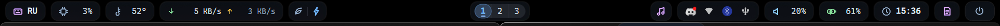
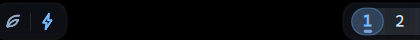

# honest-shell

Стеклянная верхняя панель для **Hyprland** на [Quickshell](https://quickshell.org) (QML/QtQuick).
Заменяет waybar: живые анимации, единый морфящий попап, воркспейсы с «памятью важности».



## Возможности

**Воркспейсы** (центр)



- Активный индикатор-«резинка»: передний край едет быстрее заднего (кривые Material 3
  Expressive с overshoot) — пилюля растягивается между воркспейсами и догоняет себя
- Занятые воркспейсы подсвечены капсулами; соседние сливаются в одну — поячеечная
  анимация склейки внутри общего слоя, без волосяных швов на дробном масштабе
- **«Тлеющий след»**: полоска под цифрой растёт и теплеет (серый → голубой → янтарь)
  от времени фокуса. Раскал ≈ 30 мин, остывание ≈ час. Статистика переживает
  hot-reload (`PersistentProperties`)
- Ячейки 4+ появляются динамически и схлопываются, когда пустеют
- Клик — переход, колесо — соседний воркспейс по кругу

**Единый морфящий попап** (паттерн caelestia)

Одно окно на все модули: при переводе курсора между пилюлями карточка гаснет,
переезжает/меняет размер пустой и проявляет новый контент уже на месте.

- **Громкость** — слайдер, устройство вывода, %
- **Батарея** — состояние, оценка времени, мощность
- **Медиа (MPRIS)** — трек, прогресс, prev/play/next
- **CPU** — load average, ядра · **GPU** — температура, загрузка · **Сеть** — интерфейс, IP, трафик

**Модули**

| Модуль | Взаимодействие |
|---|---|
| Раскладка EN/RU | клик — переключить (`hyprctl switchxkblayout`) |
| CPU % / GPU °C / ↓↑ сеть | hover — попап с деталями |
| Профиль питания eco/perf | клик — переключить (power-profiles-daemon через busctl) |
| Медиа ♪ | клик — пауза, колесо — трек, СКМ — следующий, hover — попап |
| Приватность | появляется, только когда приложение слушает микрофон |
| Трей | своё стеклянное меню (QsMenuOpener), подменю инлайн |
| Громкость | колесо ±5%, клик — pavucontrol, ПКМ — mute |
| Батарея | заливка уровня в иконке, молния при зарядке, пульс при ≤15% |
| Часы | клик — календарь на месяц (колесо листает) |
| Питание ⏻ | клик — lock/сон/ребут/выкл прямо в пилюле, ПКМ — wlogout |

**Оформление**

- Свой набор штриховых SVG-иконок (генерируются data-URI, цвет параметром) — без Nerd Font
- Дизайн-токены в одном файле `Theme.qml`: палитра, шрифт, радиусы, тайминги
- Кривые анимаций Material 3 Expressive (`spatial` с overshoot, `effects`, `decel`)
- Появление панели «занавесом» без дёрганий; ширины числовых полей зафиксированы

## Установка

Зависимости: `quickshell` (Arch: extra), Hyprland 0.4x+, при желании `pavucontrol`, `wlogout`.

```bash
git clone https://github.com/YwaGenemy/honest-shell.git ~/.config/quickshell
```

В `hyprland.conf` (или `userprefs.conf` у HyDE):

```ini
exec-once = quickshell
layerrule = blur true, match:namespace quickshell:bar
layerrule = ignore_alpha 0.4, match:namespace quickshell:bar
```

Запуск руками: `quickshell` (hot-reload при правке файлов — из коробки;
новые *файлы* подхватываются только рестартом процесса).

**HyDE**: отключи автозапуск waybar — в `~/.local/share/hypr/startup.conf`
закомментируй строку `exec-once = $start.BAR`.

## Настройка

- **Палитра/шрифт/размеры** — `Theme.qml` (всё оформление тянется отсюда)
- **Тайминги «тлеющего следа»** — `WsUsage.qml`: `interval` (тик), `0.999` (остывание),
  `fullScale` (сколько фокуса = максимум)
- **Свои устройства** — `modules/GpuTemp.qml` (PCI-путь hwmon), `modules/LayoutSwitcher.qml`
  (имя клавиатуры)
- **Состав панели** — три зоны в `Bar.qml`, модуль = одна строчка

## Структура

```
shell.qml            точка входа (Variants по мониторам)
Theme.qml            дизайн-токены (синглтон)
WsUsage.qml          «жар» воркспейсов (синглтон)
Popouts.qml          состояние морфящего попапа (синглтон)
Icons.qml            SVG-пути иконок (синглтон)
Bar.qml              окно панели, три зоны
components/          Pill, Icon, PopoutWindow, TrayMenu
modules/             Workspaces, Volume, Battery, Media, NetSpeed, Privacy, …
```

## Благодарности

Архитектурные паттерны подсмотрены у лучших Quickshell-конфигов:
[caelestia-dots/shell](https://github.com/caelestia-dots/shell) (морфящие попауты,
анимации воркспейсов), [end-4/dots-hyprland](https://github.com/end-4/dots-hyprland)
(кривые M3 Expressive, слоистые цвета), [DankMaterialShell](https://github.com/AvengeMedia/DankMaterialShell)
(data-driven модули).
